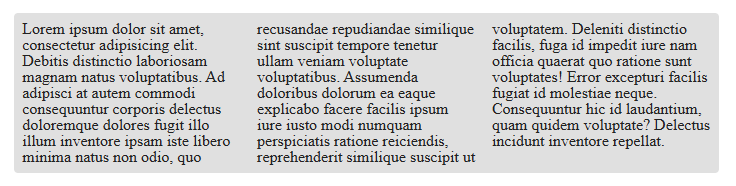

### Description:

CSS property columns.

`columns` is a property that allows you to divide text into columns.

```css
.selector {
  columns: 2 auto;
}
```

Еhe first value sets the number of columns, the second value sets their width.

### Demo:


