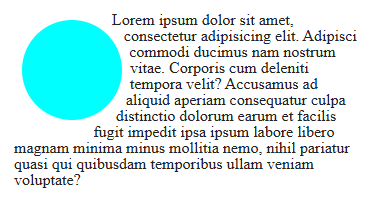

### Description:

The `shape-outside` property specifies the shape on which the text flows around the element. This allows you to create unique text fairings based on different shapes such as circles, ellipses, or polygons.

**Property parameters:**

- `circle` (radius at position) - circle with given radius and position.
- `ellipse` (radius-x radius-y at position) - ellipse with specified radius and position.
- `polygon` (point1, point2 ...) - polygon where each point is specified by coordinates.

### Demo:

